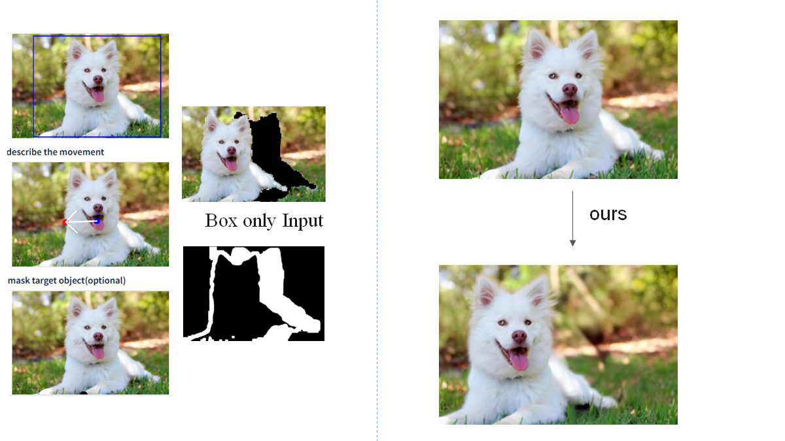
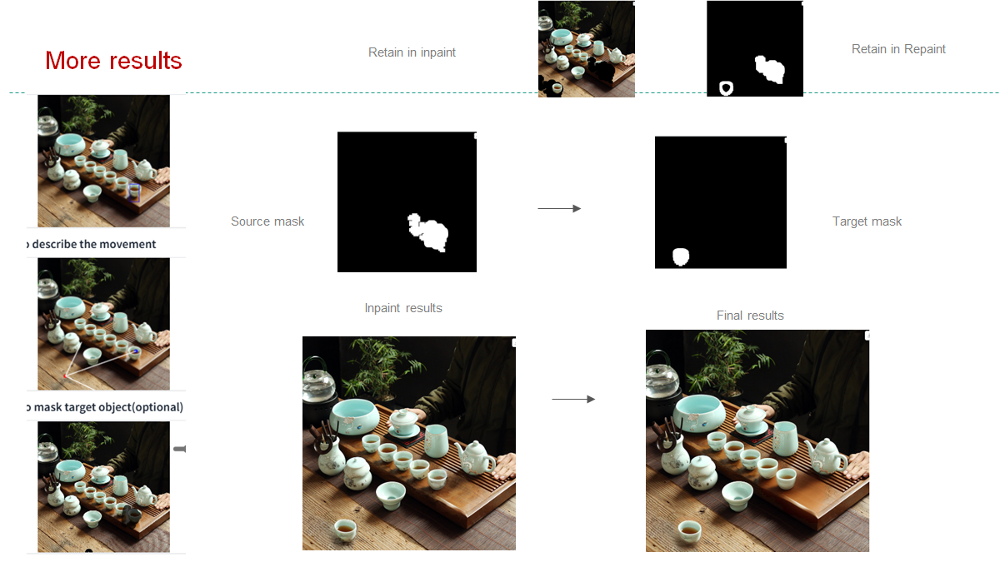
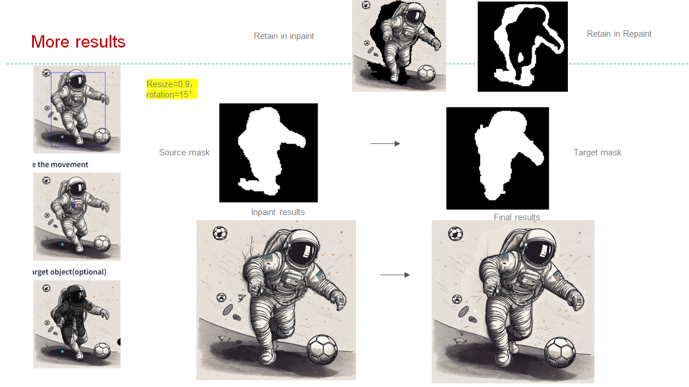
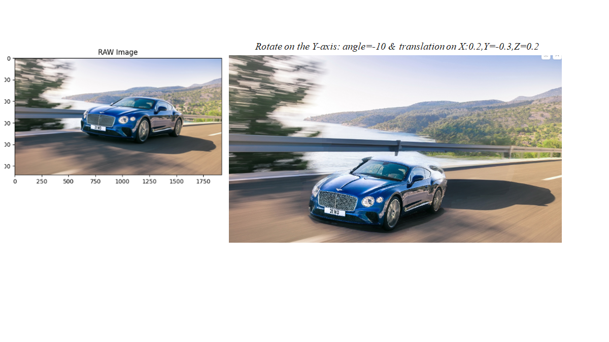
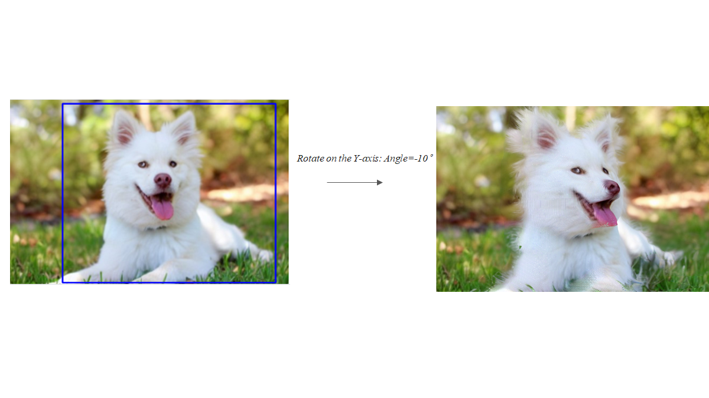
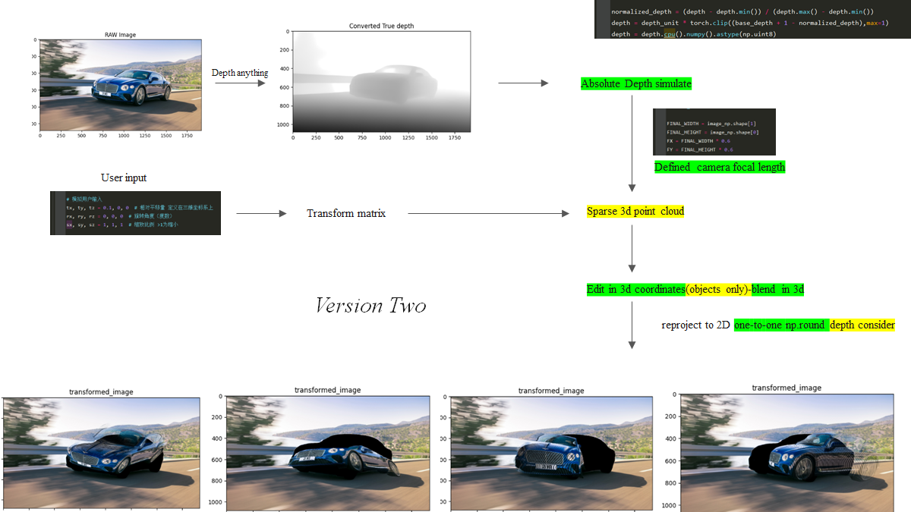
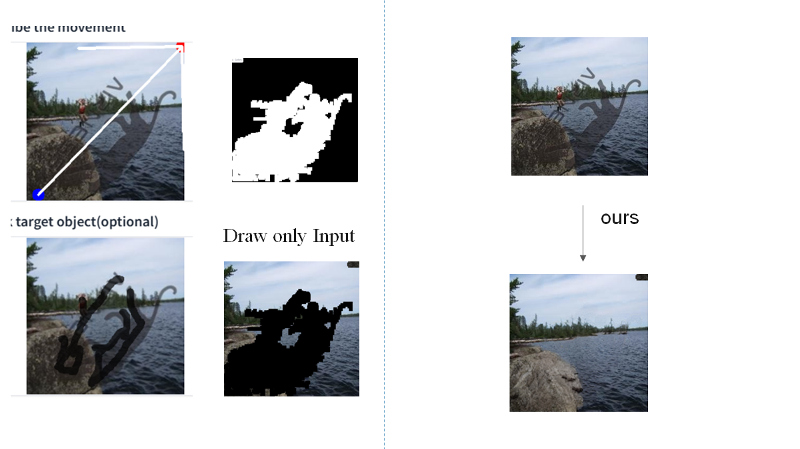

# [Reggio] Real-Image-Geometric-Editing Pipeline
- Free exploration of tuning-free geometric editing pipeline 


## 🚩 **New Features/Updates**
- Support any form of 2D/3D transformation now!
- Support for different format of user input: Box Draw / Casual Draw 
- Expansion of the orignal mask and moving with background correlation semantics
- Single Copy Paste & Generation Baseline namingly CPIG Baseline for natrual geometric editing 

---
# Introduction
**Reggio** is a turning-free method for fine-grained Real image Geo editing. 
- My_app.py : Gradio code for user friendly online CPIG operation.
- mask_expansion_main.py : Offline code for batched input [imgs+msks] and generate Expansion masks with refinement .
- src/utils/attention.py: My attention logger and controller , get expansion mask each layer /step.
- src/demo/model  ClawerModels: ensembles most of functions needed .
- dynamic_thr_vis.py playful visualization tools for dynamic thr function  selection.
- 3d_geometric_transform.py Offline code for User defined 3D operations and transforming demo .
- src/utils/geometric_utils.py: Most of my 3D transformation functions are defined here.

# 🔥🔥🔥 Main Features  

### **Object-Moving**  



### **Object-Moving**  



### **Object-Moving **  


### **3D-Editting **  


### **3D-Editting **  


### **3D-CPI-Pipeline**


### **Watermark-Removing**


# 🔧 Dependencies and Installation

- Python >= 3.8 (Recommend to use [Anaconda](https://www.anaconda.com/download/#linux) or [Miniconda](https://docs.conda.io/en/latest/miniconda.html))
- [PyTorch >= 2.0.1](https://pytorch.org/)
- [Pytorch3d](https://anaconda.org/pytorch3d/repo/files?type=any&label=main)
```bash
pip install -r requirements.txt
pip install dlib==19.14.0
pip install simple-lama-inpainting
pip install accelerate  

#OR
pip install -r my_requirements.txt
pip install dlib==19.14.0

#Besides you need to install pytorch-3d yourself.
conda install -c fvcore -c iopath -c conda-forge fvcore iopath
conda install https://anaconda.org/pytorch3d/pytorch3d/0.7.5/download/linux-64/pytorch3d-0.7.5-py39_cu117_pyt201.tar.bz2
conda install  https://anaconda.org/pytorch3d/pytorch3d/0.7.5/download/linux-64/pytorch3d-0.7.5-py39_cu121_pyt210.tar.bz2
```


# ⏬ Download Models 
All models will be automatically downloaded. You can also choose to download manually from this [url](https://huggingface.co/Adapter/DragonDiffusion).
Besides download the `sd-inpainting` model and `Depth-anything` model weights yourself.

# 💻 How to Test
Inference requires at least `22GB` of GPU memory for editing a `768x768` image.  
We provide a quick start on gradio demo.
```bash
python My_app.py 
```
run this command to generate expansion mask for local imgs and org masks. An offline version
which is easier to debug
```bash
python mask_expansion_main.py
```
run this command to debug 3D-Editing opereation without gradio. An offline version
```bash
python 3d_geometric_transform.py
```


# 💻 Relate Repos
[1] <a href="https://github.com/MC-E/DragonDiffusion>DragonDiffusion">DragonDiffusion: Enabling Drag-style Manipulation on Diffusion Models</a>
</p>
[2] <a href="https://github.com/advimman/lama">LaMa: Resolution-robust Large Mask Inpainting with Fourier Convolutions</a>
</p>
[3] <a href="https://github.com/runwayml/stable-diffusion?tab=readme-ov-file#inpainting-with-stable-diffusion">Image Modification with Stable Diffusion</a>
</p>
[4] <a href=https://github.com/LiheYoung/Depth-Anything>Depth Anything: Unleashing the Power of Large-Scale Unlabeled Data</a>
</p>


