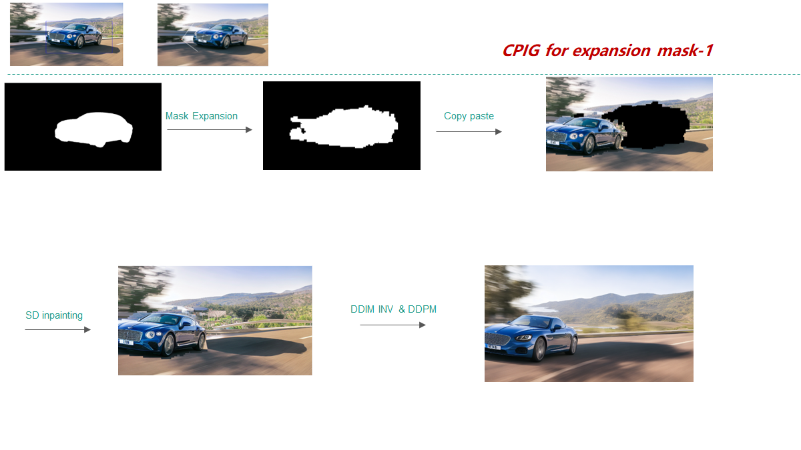
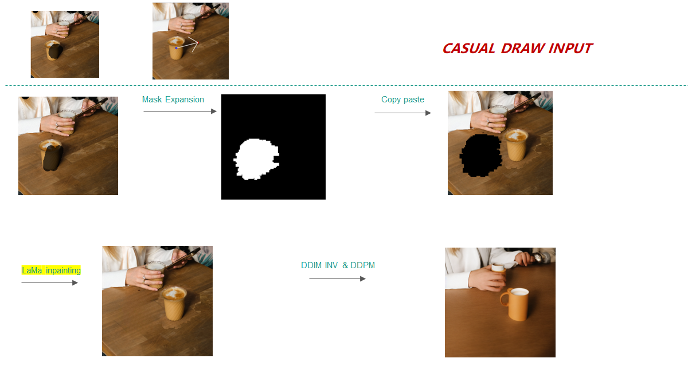

# [Reggio] Real-Imgae-Geometric-Editing Pipeline
-Free exploration of tuning-free geometric editing pipeline 


## 🚩 **New Features/Updates**
- Support for different format of user input: Box Draw / Casual Draw 
- Expansion of the orignal mask and moving with background correlation semantics
- Single Copy Paste & Generation Baseline namingly CPIG Baseline for natrual geometric editing 

---
# Introduction
**Reggio** is a turning-free method for fine-grained Real image Geo editing. 
- My_app.py : Gradio code for user friendly online CPIG operation.
- mask_expansion_main.py : Offline code for batched input [imgs+msks] and generate Expansion masks with refinement .
- src/utils/attention.py: My attention logger and controller , get expansion mask each layer /step.
- src/demo/model  ClawerModels: ensembles most of functions needed .
- dynamic_thr_vis.py playful visualization tools for dynamic thr function  selection.

# 🔥🔥🔥 Main Features  
### **Mask Expansion **  
expansion mask from given obj mask & binary mask refine 

<p align="center">
  
</p>

### **Mask Expansion**  


### **Object Moving with box input**  

<<<<<<< HEAD

=======
<p align="center">
  
</p>
>>>>>>> 993bba2 (Update README.md)


<<<<<<< HEAD

### **Object Moving with casual draw**  



=======
<p align="center">
  
</p>
>>>>>>> 993bba2 (Update README.md)

# 🔧 Dependencies and Installation

- Python >= 3.8 (Recommend to use [Anaconda](https://www.anaconda.com/download/#linux) or [Miniconda](https://docs.conda.io/en/latest/miniconda.html))
- [PyTorch >= 2.0.1](https://pytorch.org/)
```bash
pip install -r requirements.txt
pip install dlib==19.14.0
pip install simple-lama-inpainting
```

# ⏬ Download Models 
All models will be automatically downloaded. You can also choose to download manually from this [url](https://huggingface.co/Adapter/DragonDiffusion).
Besides download the sd-inpainting model yourself

# 💻 How to Test
Inference requires at least `22GB` of GPU memory for editing a `768x768` image.  
We provide a quick start on gradio demo.
```bash
python My_app.py 
```
run this command to generate expansion mask for local imgs and org masks. An offline version
which is easier to debug
```bash
python mask_expansion_main.py
```


# 💻 Relate Repos
[1] <a href="https://github.com/MC-E/DragonDiffusion>DragonDiffusion">DragonDiffusion: Enabling Drag-style Manipulation on Diffusion Models</a>
</p>
[2] <a href="https://github.com/advimman/lama">LaMa: Resolution-robust Large Mask Inpainting with Fourier Convolutions</a>
</p>


