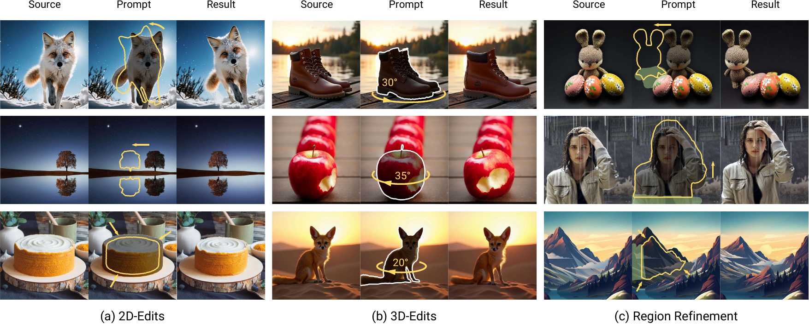
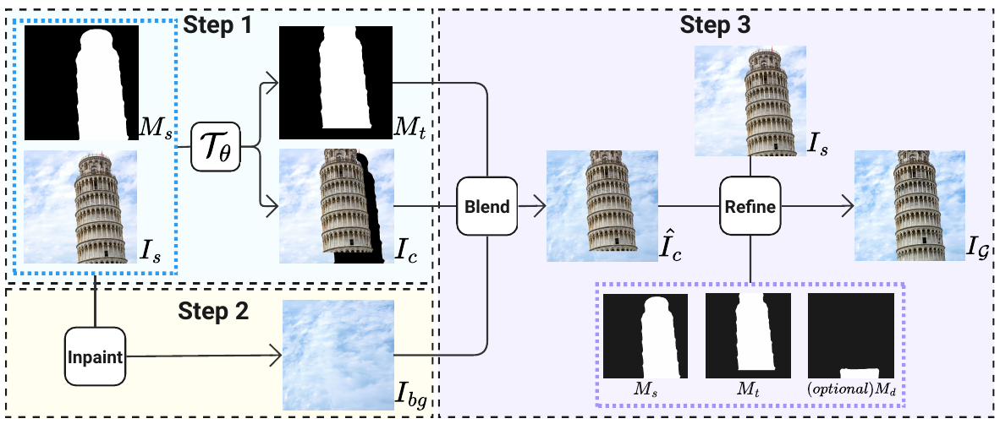

# FreeFine: Training-Free Diffusion for Geometric Image Editing





**Official Implementation of ICCV 2025 Submission** | [Project Page]() | [arXiv Paper]() | [GeoBench Dataset]()  

---

## 🌟 Introduction  
We present **FreeFine**, a novel framework for high-fidelity geometric image editing that enables **object repositioning**, **reorientation**, and **reshaping** while maintaining global coherence. Remarkably, our framework simultaneously achieves **structure completion**, **object removal**, **appearance transfer**, and **multi-image composition** within a unified pipeline - all through efficient training-free diffusion. 

Unlike existing diffusion-based editing methods that struggle with large/complex transformations, our approach introduces a decoupled pipeline that separates:



## 📢 News & Updates  
**2025-07-15**  
🚀 Codebase released with:  
- Pre-trained models for all GeoBench scenarios  
- Jupyter notebook tutorials  
- Windows/Linux compatibility patches  

**2025-06-30**  
🏆 Accepted to **ICCV 2025**! Paper [arXiv link]() now available  

**2025-03-02**  
📊 Submited to **ICCV 2025**!

# 🔥🔥🔥 Main Features  

### **Object-Moving**  


### **Object-Moving**  


### **Object-Moving **  


### **3D-Editting **  


### **3D-Editting **  


### **3D-CPI-Pipeline**


### **Watermark-Removing**


## 🛠️ Installation  

- Python >= 3.8 , PyTorch >= 2.0.1
```bash
git clone https://github.com/CIawevy/FreeFine.git
cd FreeFine
conda create -n freefine python=3.9.19 -y
conda activate freefine
pip install -r requirements.txt
```

# ⏬ Download Models 
All models will be automatically downloaded by using diffuser. You can also choose to download them locally through the following scripts
```bash
bash scripts/download_models.sh
```
# 🚀 Quick Start 
Run On Web Interface
```bash
python app.py  # Launch Gradio UI  
```
Run On Jupyter Notebooks
```bash
cd jupyter_demo
```
Inference & Eval
```bash
python Eval/inference.py
```

# 📚 Relate Repos
[1] <a href="https://github.com/MC-E/DragonDiffusion>DragonDiffusion">DragonDiffusion: Enabling Drag-style Manipulation on Diffusion Models</a>
</p>
[2] <a href=https://github.com/google/prompt-to-prompt>PROMPT-TO-PROMPT IMAGE EDITING
 WITH CROSS-ATTENTION CONTROL</a>
</p>
[3] <a href=https://github.com/design-edit/DesignEdit>DesignEdit: Unify Spatial-Aware Image Editing via Training-free Inpainting with a Multi-Layered Latent Diffusion Framework</a>
</p>


## 📜 Citation  
```bibtex
@inproceedings{freefine2025,
  title={FreeFine: Training-Free Geometric Editing via Decoupled Diffusion}, 
  author={Your Name and Coauthors},
  booktitle={ICCV},
  year={2025}
}


